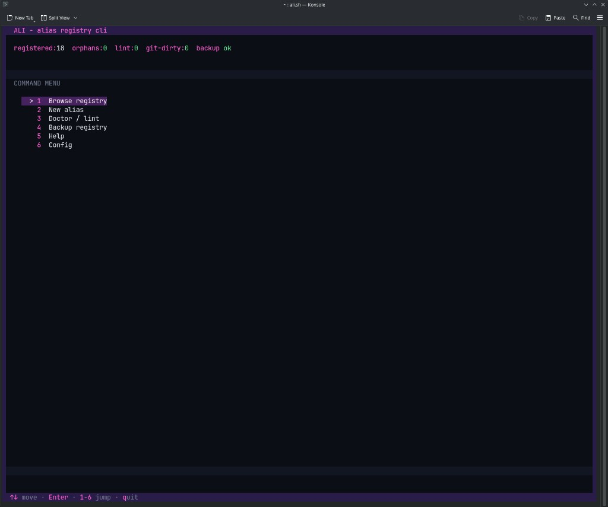
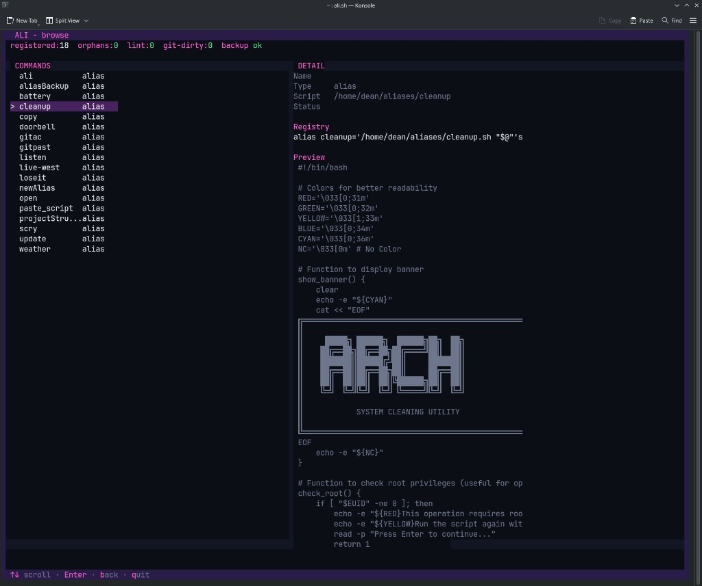

# ALI — Alias Registry CLI

**ALI** is a bash TUI and CLI for managing a personal shell alias system: a flat registry file that maps command names to scripts, loaded once from `~/.bashrc`.

Use it to browse registered commands, scaffold new aliases, lint the registry, back up your setup, and configure paths for your machine.

## Screenshots

### Home menu

Status pills at the top (registered, orphans, lint, git-dirty, backup). Command menu with keyboard navigation in the footer.



### Browse registry

Split view: command list on the left, detail panel on the right (registry line + script preview).



## How it fits together

```
Interactive bash
       │
       ▼
  ~/.bashrc  ──►  source ~/alias_registry.sh
       │
       ▼
  alias_registry.sh  ──►  alias weather → ~/aliases/weather.sh "$@"
       │
       ▼
  ~/aliases/*.sh  ──►  command implementations
```

| Piece | Default path | Role |
|-------|----------------|------|
| Registry | `~/alias_registry.sh` | Maps names → scripts (not in this repo) |
| Scripts | `~/aliases/` | This repo — executable implementations + ALI |
| User config | `~/.config/ali/config` | Optional path overrides (via `ali` → Config) |
| Backup | `~/Dev/my_arch_mods/alias_registry` | Snapshot target for `ali backup` |

The registry lives outside this git repo on purpose: it is machine-local wiring. Script logic lives here and is version-controlled.

## Requirements

- **bash** 4+
- **coreutils**, **grep** (ripgrep used when available)
- Terminal with ANSI color and alternate-screen support (Konsole, iTerm, most modern emulators)
- Optional: **git** (backup can commit script changes), **rsync** (faster backup copy)

## Quick start

### 1. Clone

```bash
git clone git@github.com:deanOfWalls/ali.git ~/aliases
chmod +x ~/aliases/ali.sh ~/aliases/*.sh
```

### 2. Create a registry and wire up bash

```bash
# Preview the block to add to ~/.bashrc
bash ~/aliases/ali.sh config bashrc
```

Add the printed block inside the interactive section of `~/.bashrc` (after `[[ $- != *i* ]] && return` if you use that guard):

```bash
# === Aliases ===
export REGISTRY="$HOME/alias_registry.sh"
export ALIASES_DIR="$HOME/aliases"
export BACKUP_DIR="$HOME/alias_registry_backup"
source "${REGISTRY}"
```

Create the registry and register ALI itself:

```bash
touch ~/alias_registry.sh
echo "alias ali='${HOME}/aliases/ali.sh \"\$@\"'" >> ~/alias_registry.sh
source ~/.bashrc
```

`PS1=...` is **not** required — it only sets your shell prompt and has nothing to do with aliases.

### 3. Open the TUI

```bash
ali
# or: ali tui
```

Use **Config** (menu item 6) to change registry, scripts, or backup paths. Settings are saved to `~/.config/ali/config`.

## TUI menu

| # | Action |
|---|--------|
| 1 | Browse registry — scroll entries, preview script + registry line |
| 2 | New alias — scaffold script + registry entry |
| 3 | Doctor / lint — health checks |
| 4 | Backup registry — snapshot + optional git commit |
| 5 | Help — CLI reference |
| 6 | Config — paths and `~/.bashrc` setup snippet |

**Browse:** Enter opens actions (disable/enable, rename, remove). Keys shown in the footer.

## CLI

```bash
ali                     Open TUI (default)
ali list                List registered commands
ali new <name>          Create script + registry entry
ali remove <name>       Unregister and delete script
ali rename <old> <new>  Rename command (and script when applicable)
ali orphan [path]       Register an unlinked script
ali doctor              Lint registry + scripts
ali refresh             Reload aliases in current shell
ali backup              Copy registry + scripts; commit if git repo
ali config              Show paths and config file location
ali config bashrc       Print ~/.bashrc setup lines
ali config set registry <path>
ali config set scripts <path>
ali config set backup <path>
ali help                Full help text
```

`ali config` works even when the registry file does not exist yet.

## Doctor checks

Built into ALI (not an external tool). For **enabled** registry entries:

- Unquoted `$@` on alias lines (should be `"$@"`)
- Unparseable script path, missing script, not executable
- Orphan scripts under `ALIASES_DIR` not listed in the registry

## Project layout

```
~/aliases/
├── ali.sh              Entrypoint
├── ali/
│   ├── cmd/            Subcommands (list, new, tui, config, doctor, …)
│   ├── lib/            Core libraries (registry, TUI, config, UI)
│   └── test/           TUI regression tests
├── *.sh                Your command scripts (personal / examples)
└── README.md
```

Legacy helpers (`newAlias.sh`, `aliasBackup.sh`) remain for backward compatibility; prefer `ali new` and `ali backup`.

## Registry conventions

Prefer quoted arguments so spaces and globs behave:

```bash
alias mycmd='/home/you/aliases/mycmd.sh "$@"'
```

Use a shell function when all arguments should become one string:

```bash
math() { /home/you/aliases/math.sh "$*"; }
```

## Backup

`ali backup` copies:

- `alias_registry.sh` → backup dir
- `~/aliases/` (excluding `.git`) → backup dir / `aliases/`

If `~/aliases` is a git repository, backup also commits with a timestamp message.

## Development

Syntax check:

```bash
bash -n ali.sh
bash -n ali/lib/*.sh ali/cmd/*.sh
```

TUI input stress test (PTY):

```bash
python3 ali/test/tui_spam_test.py 5 200
```

## License

Licensed under the [PolyForm Noncommercial License 1.0.0](LICENSE).

You may use, modify, and share this software for **personal and other noncommercial purposes**. Commercial use (selling, SaaS, ads, etc.) is not permitted without separate permission. See [polyformproject.org](https://polyformproject.org/licenses/noncommercial/1.0.0) for details.
